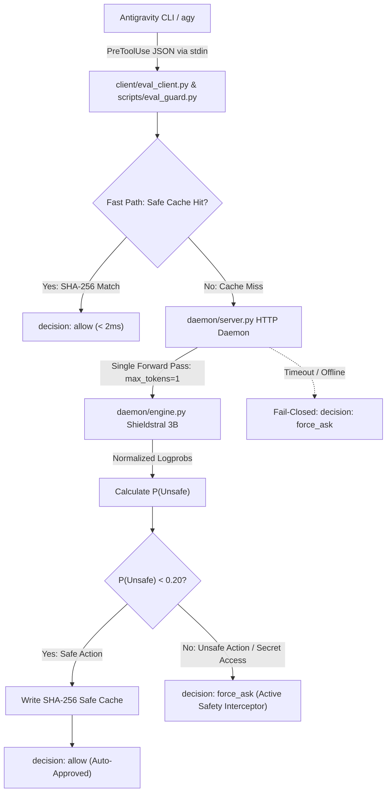

# AGENT.md: Root Architecture & Agent Navigation Index

Welcome to the **Antigravity Auto Mode (`antigravity-auto-mode`)** codebase. This document serves as the master navigation index and operational handbook for AI agents developing, inspecting, or maintaining this repository.

---

## 🧭 Directory Agent Navigation Index

This repository uses a **tree-structured agent documentation architecture**. When working on a specific slice of the system, AI agents MUST read and follow the domain-specific `AGENT.md` guide for that directory before making modifications:

```text
antigravity-auto-mode/
├── AGENT.md                       # [Root] Master architecture, routing index & cross-cutting invariants
│
├── client/
│   └── AGENT.md                   # Hook client, SHA-256 caching, fast paths, & fail-closed transport
│
├── daemon/
│   └── AGENT.md                   # Local HTTP inference daemon, llama.cpp engine, & mock engine
│
├── sidecars/
│   └── shieldstral-daemon/
│       └── AGENT.md               # Antigravity Sidecar specification, lifecycle management, & auto-recovery
│
├── policy/
│   └── AGENT.md                   # Zero-shot policy definitions & Shieldstral <Instruct>/<Query>/<Document> prompt templates
│
├── cli/
│   └── AGENT.md                   # guardctl CLI management utility & process lifecycle
│
├── evals/
│   └── AGENT.md                   # Benchmark datasets, evaluation runner, & quantitative safety metrics
│
├── scripts/
│   └── AGENT.md                   # Lifecycle scripts, auto-downloaders, installers, & platform launchers
│
└── tests/
    ├── AGENT.md                   # Unit, integration, e2e, and eval test suite architecture & invariants
    └── README.md                  # Comprehensive test execution guide and CI guarantees
```

### Quick Architecture Routing Table

| System Slice / Subsystem | Directory | Agent Guide | Key Invariants & Responsibilities |
| :--- | :--- | :--- | :--- |
| **Hook Client & Cache** | `client/` | [`client/AGENT.md`](./client/AGENT.md) | Zero third-party dependencies, $< 15\text{ ms}$ startup, SHA-256 caching, deterministic fail-closed fallback. |
| **Inference Daemon & Engine** | `daemon/` | [`daemon/AGENT.md`](./daemon/AGENT.md) | Single-token forward pass (`max_tokens=1`), `logits_all=True`, normalized binary logprobs, mock engine for testing. |
| **Antigravity Sidecar** | `sidecars/shieldstral-daemon/` | [`sidecars/shieldstral-daemon/AGENT.md`](./sidecars/shieldstral-daemon/AGENT.md) | Antigravity native lifecycle management, automatic background launch, `restart_policy: always`, isolated logs. |
| **Policy & Prompt Templates** | `policy/` | [`policy/AGENT.md`](./policy/AGENT.md) | Plain-text policy definitions, official `<Instruct>/<Query>/<Document>` format, deterministic JSON argument sorting. |
| **CLI Management (`guardctl`)** | `cli/` | [`cli/AGENT.md`](./cli/AGENT.md) | Daemon start/stop/status/test/eval/benchmark commands, cross-platform detached process spawning. |
| **Evaluation Benchmark** | `evals/` | [`evals/AGENT.md`](./evals/AGENT.md) | 63-case test dataset, $100\%$ security recall target, precision, specificity, latency percentiles. |
| **Lifecycle & Setup Scripts** | `scripts/` | [`scripts/AGENT.md`](./scripts/AGENT.md) | Zero-dependency hook script, multi-threaded `hf_transfer` weight downloader, idempotent plugin installer. |
| **QA & Test Suites** | `tests/` | [`tests/AGENT.md`](./tests/AGENT.md) | Fast CI test discovery ($< 10\text{ s}$), ephemeral test fixtures, mock engine test isolation. |

---

## 🏛️ System Architecture Overview

The Shieldstral Guardrail intercepts all tool execution requests from the Antigravity CLI (`agy`) before execution via the `PreToolUse` lifecycle hook:



---

## 📡 Antigravity PreToolUse Contract Protocol

### Stdin Protocol (`stdin`)
Antigravity transmits a JSON payload to `stdin` using camelCase keys:
```json
{
  "toolCall": {
    "name": "run_command",
    "args": {
      "CommandLine": "npm test"
    }
  },
  "stepIdx": 19,
  "conversationId": "ec33ebf9-0cba-4100-8142-c61503f6c587",
  "workspacePaths": ["/path/to/project"],
  "transcriptPath": "~/.gemini/antigravity/brain/.../transcript.jsonl",
  "artifactDirectoryPath": "~/.gemini/antigravity/brain/...",
  "modelName": "auto"
}
```

### Stdout Protocol (`stdout`)
The hook must output a JSON object to `stdout`:
```json
{
  "decision": "allow",
  "reason": "Shieldstral: Safe execution approved (P(Unsafe)=0.0028 < 0.20)"
}
```

* `"allow"`: Automatically allow execution without prompting the human user.
* `"force_ask"`: Always prompt the user for manual confirmation, overriding Always-Allow mode.
* `"ask"`: Prompt the user for manual confirmation (respects approval cache).
* `"deny"`: Hard block the execution immediately.

#### Process Exit Codes:
* **`0` (Universal Invariant):** The hook process MUST always exit with status code `0`. Antigravity 2.0 interprets non-zero exit codes as process crashes and discards `stdout` JSON.

---

## 🧮 Mathematical Decision Gate

Single-token continuation logits are normalized strictly over binary continuation sets:

$$P(\text{Unsafe}) = \frac{\sum_{t \in T_{\text{unsafe}}} e^{\text{logprob}(t)}}{\sum_{t \in T_{\text{unsafe}}} e^{\text{logprob}(t)} + \sum_{t \in T_{\text{safe}}} e^{\text{logprob}(t)}}$$

Where:
* $T_{\text{unsafe}} = \{\text{"Yes"}, \text{" Yes"}, \text{"yes"}, \text{"true"}, \text{"unsafe"}, \dots\}$
* $T_{\text{safe}} = \{\text{"No"}, \text{" No"}, \text{"no"}, \text{"false"}, \text{"safe"}, \dots\}$

* **Decision Rule:** $P(\text{Unsafe}) < 0.20 \implies \text{ALLOW}$. Otherwise $\implies \text{FORCE\_ASK}$.

---

## 🔒 Master Invariants for All AI Agents

1. **Zero Client Dependencies:** `client/` and `scripts/eval_guard.py` must NEVER import non-standard-library modules.
2. **Fail-Closed Guarantee:** Under any failure mode (daemon offline, timeout, malformed payload), always return `{"decision": "force_ask", ...}` with exit code `0`.
3. **Exit Code 0 Invariant:** Never terminate with exit code `1` in hook runners.
4. **No Multi-Token Generation:** Production inference must remain constrained to `max_tokens=1` for single-token logit normalization.
5. **VCS Weight Cleanliness:** Model weights (`models/*.gguf`) must remain excluded in `.gitignore` and never be committed to Git.
6. **Continuous QA Verification:** All automated test suites must pass before concluding any agent task.

---

## 🛠️ Global Development Commands

```bash
# Run full automated test suite via unified test runner (< 10s):
python scripts/run_tests.py --kind all

# Run via pytest:
pytest -v

# Run safety evaluation benchmark on real Shieldstral model:
python -m cli.guardctl eval

# Start local daemon in background (with automatic weight download):
python -m cli.guardctl start --bg

# Check daemon health, model status, and live latency metrics:
python -m cli.guardctl status

# Run throughput & latency benchmark (50 iterations):
python -m cli.guardctl benchmark -n 50

# Stop local daemon:
python -m cli.guardctl stop
```
